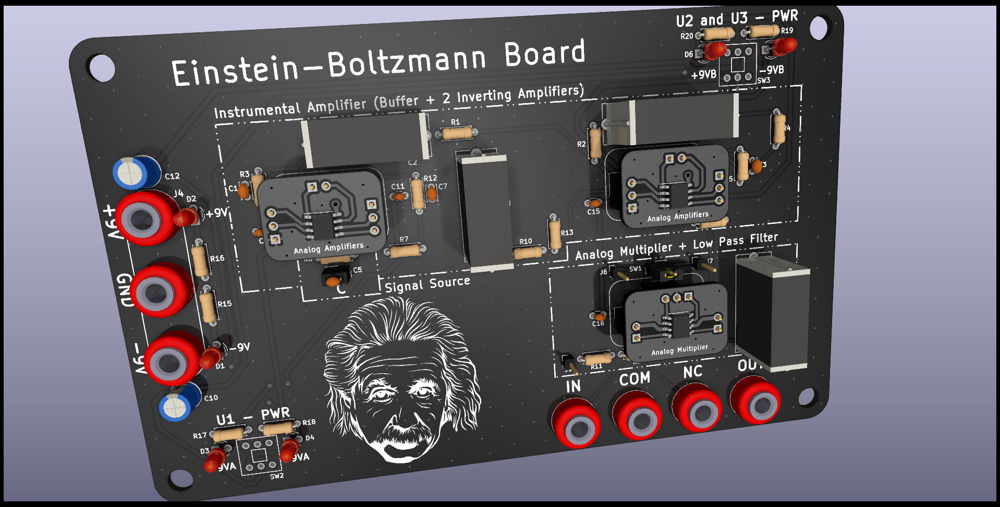
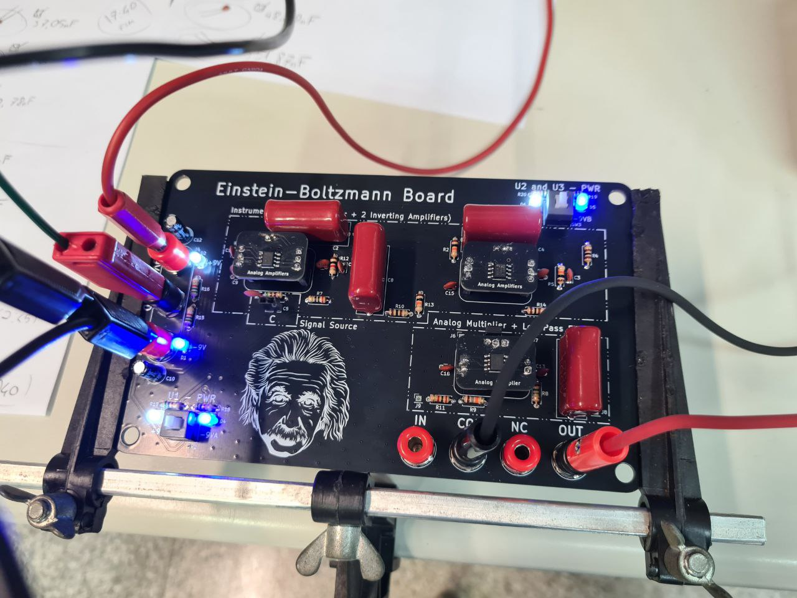
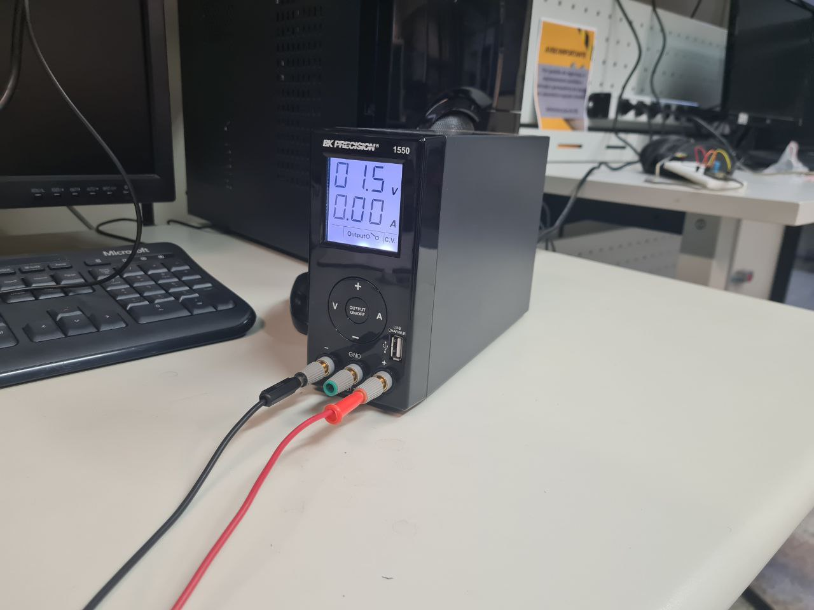
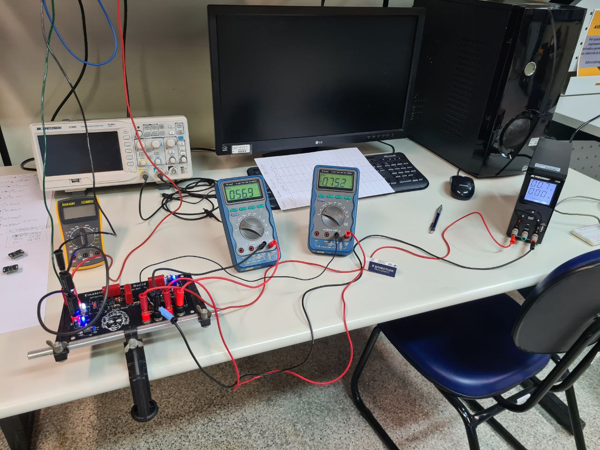
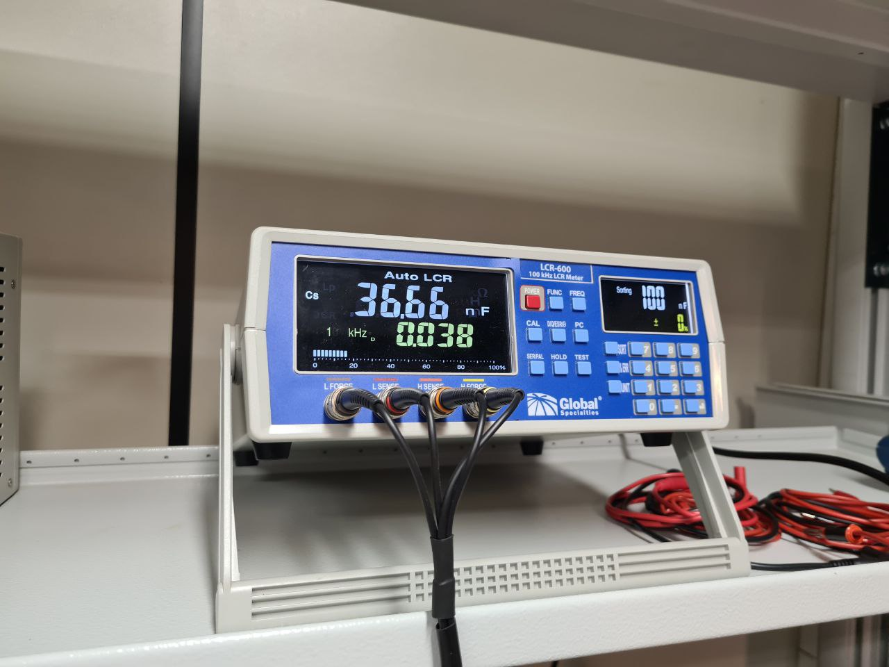
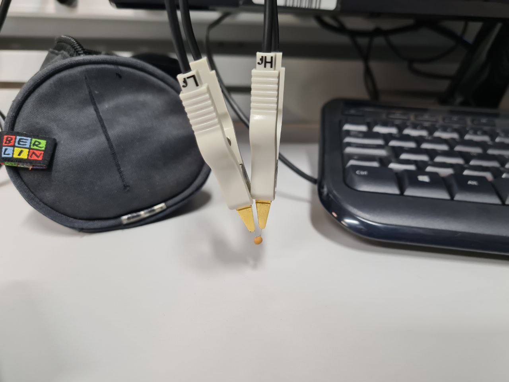
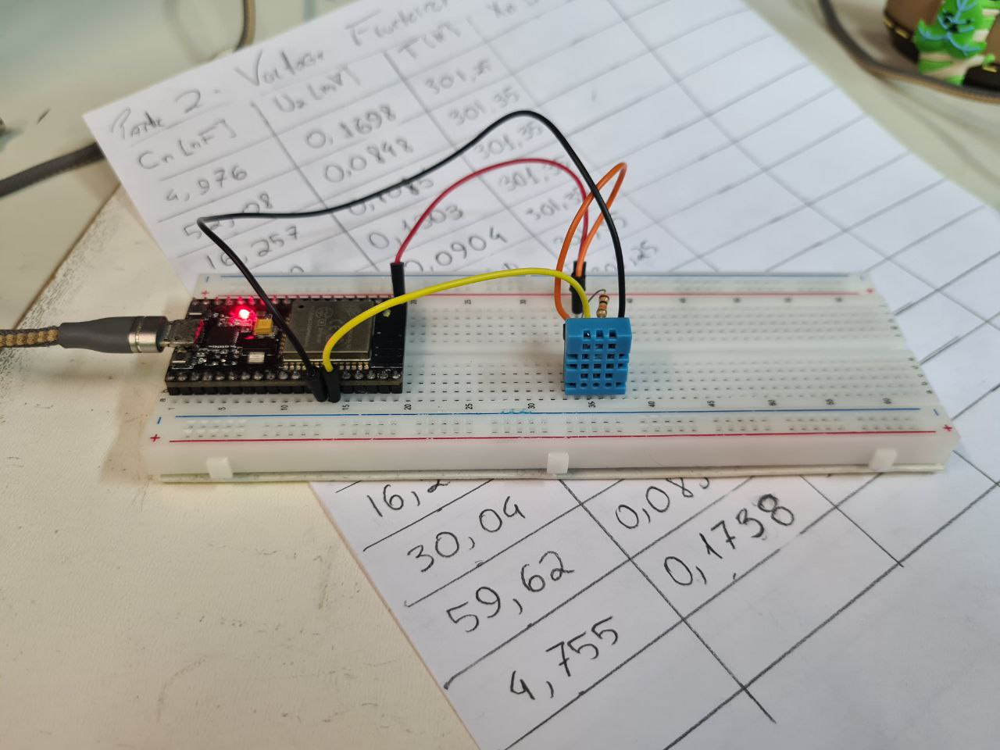
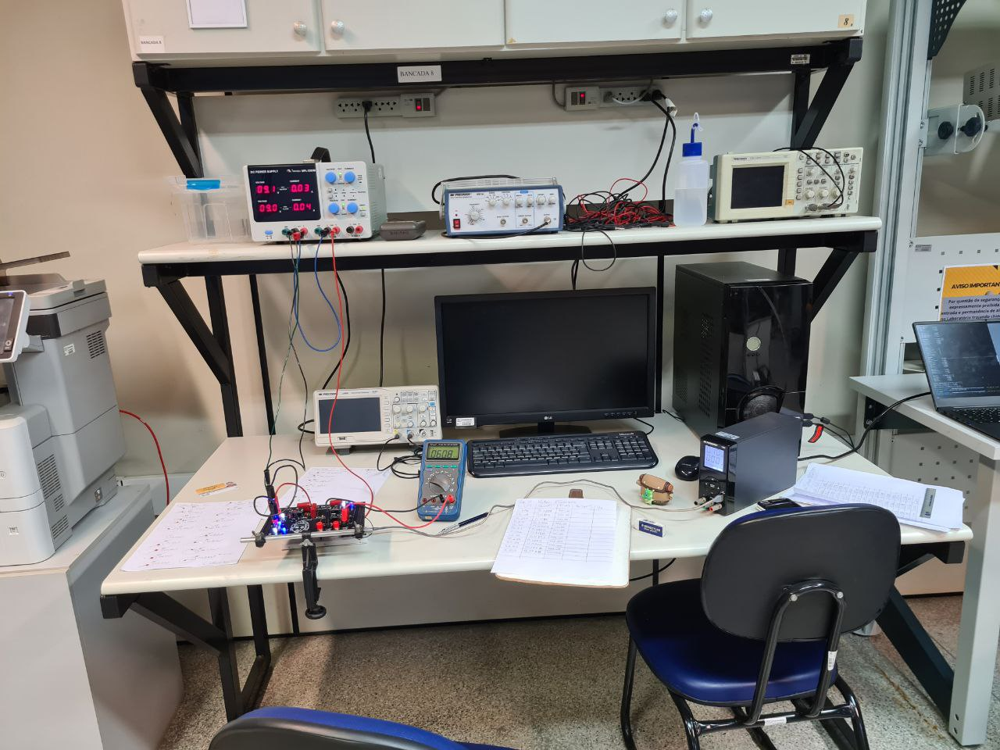
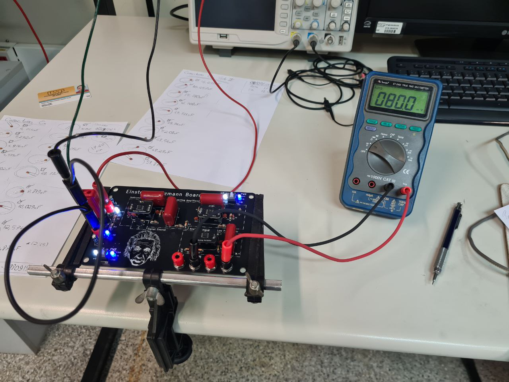



After a big hiatus since my first post, it's finally time to add new
content to this empty blog. In this second post, I'll introduce the
project I've be working on since January: the **Einstein-Boltzmann
Board**.


TODO: Continue from here:....


 ## What is the board

This is a board to replicate the experiment of the [5-th Experimental
Physics Olympiad (2017)](https://arxiv.org/abs/1801.00022). Which the
original purpose is to determine the Boltzmann by evaluating the mean of
the thermal energy of a electrical system.

Also, important to inform that all the scripts used to analyze the data
and also the data are provided at the [Project's Github repository](https://github.com/CarlosCraveiro/einstein-boltzmann/tree/main).



All the project is Open Hardware licensed under [CERN Open Hardware
Licence Version 2 - Strongly Reciprocal](https://cern-ohl.web.cern.ch/home). I made the layout using [KiCad
EDA](https://www.kicad.org/) and manufactured the project at
[JLCPCB](https://jlcpcb.com/), needles to say that this project was not
sponsored by them in any way.

## What it does?

The idea is to basically determine the Boltzmann constant (\\(k_b\\)) by
averaging the thermal noise generated by a RC circuit (Resistor in
parallel with a Capacitance), the noisy source is the resistor and the
noise that we are talking about is known as [Johnson–Nyquist
noise](https://en.wikipedia.org/wiki/Johnson%E2%80%93Nyquist_noise).


If you are not so interested in the physics or electronics derivation you
can jump for the **Simplified Explanation** in the end of this section
just to have at least a very abstract notion about what this board does.

Continuing, as we are working with white noise, a random or stochastic
process with zero mean, we need to work with it's Power Spectral Density,
or just [PSD](https://www.geeksforgeeks.org/power-spectral-density/), with
that in mind, its known that Johnson–Nyquist noise has a nearly a constant
PSD:

$$S_{res}(f) = 4k_B T R$$

Observation that in some places you will find it as 2kBTR or 4kBTR, but
this is just a matter of if when you integrate you will integrate from
-infinity to +infinity (2kBTR, which I'll be using because the Book that
I used as reference Modern Digital and Analog Communication (The Oxford
Series in Electrical and Computer Engineering) by B.P.Lahthi and Zhi Ding
does in that way) or from 0 to +infinity (4kBTR, because noise is an even
function). With that in mind you can say that your noisy resistor could be
split in a noiseless resistor R and a noise source Vg (diagram 1), in that
way, connecting the capacitor you get the system at diagram 2, which in
fact is a [low pass filter
(LPF)](https://en.wikipedia.org/wiki/Low-pass_filter), a widely known
circuit among the electrical and electronics engineers, but for those who
are not familiar with it, just known that this behaves as an LTI (Linear
and Time Invariant) System with [Transfer
Function](https://en.wikipedia.org/wiki/Transfer_function) (maybe here
another magic word from the electronic field, but it is just
a mathematical relation that models the system's output for each possible
input - it mathematically describes the behaviour of LTI systems) of

$$ H(j\omega) = \frac{1}{1 + j \omega R C}, $$

where \\( \omega = 2 \pi f \\), so

$$ H(f) = \frac{1}{1 + j 2 \pi f R C}.$$


```
           +--o a                +------+-o a         
           |                     |      |      ^    
           |                     |      |      |      
          .+.                   .+.     |           
        R | |                 R | |     |      |    
          '+'                   '+'    _|_          
           |                     |     ---  C  |  Vo 
        + ,+.                 + ,+.     |            
      Vg (   )              Vg (   )    |      |     
        - `+'                 - `+'     |            
           |                     |      |      |      
           |                     |      |      v
           +--o b                +------+-o b
           
         (Diagram 01)            (Diagram 02)
```

In this, case we also know the relation between Input and Output PSD of
LTI a System, our LPF, which is given by:

$$ S_{out}(f) = |H(f)|^2 \cdot S_{in}(f)$$

So, considering \\(S_{res}(f)\\) as the input of the LPF, we can say that
the output of this system is:

$$ S_{o}(f) = \Big|\frac{1}{1 + j2\pi fRC}\Big|\cdot 2k_BTR = \frac{2k_BTR}{1+ 4 \pi^2 f^2 R^2 C^2} $$

And with this result, we can take the property that the mean square
voltage \\((\overline{v_o^2})\\) of a signal with PSD described by
\\(S_o(f)\\) is given by:

$$ \overline{v_o^2} = \int_{-\infty}^{+\infty}{S_o(f)df} $$

, so in our case:

$$\overline{v_o^2}=\int_{-\infty}^{+\infty}{\frac{2k_BTR}{1+4\pi^2f^2R^2C^2}df}=\frac{k_BT}{C}$$

And ta-da! We have that the mean square of our noise is a known value that
not depends on the frequency, with limited and low bandwidth
\\((RC)^{-1}\\) of about tens of kilohertz in our case. And most
important, only depends on the Boltzmann constant (\\(k_B\\)), the
temperature (\\(T\\)) and the capacitance (\\(C\\)). So in theory if we
know accurately the value of a certain group of capacitances (\\(C_n\\)),
and measure both the temperature in which the experiment will be performed
and the mean square voltage on the terminals `(a)` and `(b)` (diagram 2),
we can actually determine the Boltzmann constant by plotting the following
linear relation:

$$\overbrace{\frac{\overline{v_o^2}}{T}}^y=k_B\overbrace{\frac{1}{C}}^x$$


Our only problem is that actually if you make some napkin calculations,
you notice that this value is actually way too small to be measured by any
normal equipment like a multimeter, actually in the order of magnitude of
*atto volts* (\\(10^{-14}\\)).

To solve this problem, the solution is actually not to complicated. We
just need to amplify the signal, but not for like thousands of billion
times, we can actually amplify the signal before square meaning it by
a million times and then this will give us the equivalent amplification by
"thousands of billions". And this is exactly what the circuit proposed for
the 5-th EPO does, it uses a very famous and widely known circuit
topology, the [Instrumentation
Amplifier](https://en.wikipedia.org/wiki/Instrumentation_amplifier), but
with some modifications like a bandpass filter inside-it planned to
capture only the noise that we want to measure and instead of using
a non-inverting amplifier, it uses two inverting amplifiers
(configurations of [operational amplifiers
(OP-AMPS)](https://en.wikipedia.org/wiki/Operational_amplifier)) to
achieve the same result, but with more gain. Also important to point out,
they used ( **ADA4898** ) low-noise OP-AMPS to build this instrumental
amplifier, which I choose to do the same for the sake of reproducibility.

And at the end it uses a voltage multiplier an **AD633** to take the
square voltage and a final LPF that "cuts off" higher frequencies and let
in the end a comparable very slow signal that is averaged by the
multimeter.

### Simplified Explanation

Basically you have a signal source given by

Amplify it by a million times, using what is known as [Instrumentation
Amplifier](https://en.wikipedia.org/wiki/Instrumentation_amplifier), them
square the signal using an **AD633** and in the end take the average. And
with this by plotting:

$$\overbrace{\frac{\overline{(v_o\cdot{G_{Instr}})^2}G_{square}}{T}}^y=k_B\overbrace{\frac{1}{C}}^x$$

it is possible to find the Boltzmann constant (\\(k_B\\)). Where,\\(C_n\\)
is a certain capacitance in Farads, (\\(T\\)) is the Temperature in
Kelvin, \\(G_{Instr}\\) is the gain of the instrumentation amplifier and
\\(G_{square}\\) is the gain of the **AD633** circuit.

I tried to give you the general overview of the circuit, but for more
information you can find in the original guide for the EPO-5th or their [other article](https://iopscience.iop.org/article/10.1088/1361-6404/ab07e0) and I'll try to write a Wiki for the project at
GitHub with a "complete tour" of the board with the simulation of each
stage. But this is part of future work. Other important things to point
out, first that I only found their "other article" when I was searching
references for this post, so I really recommend for you to take a look
because their explanation is way more complete than mine. I did not
account for example the frequency dependent amplification witch actually
implies a correction factor \\( \epsilon \\) to the measurements. (This
can be seen at the results I got - without the correction factor)



## But can it actually measure Boltzmann?

To answer this question i need to talk about the experiments I did...

## The experiments

I performed the experiments at LA-SEL ( *Laboratório Aberto da SEL* ), the
Electronic Department ( **SEL** ) Open Laboratory, a 24h lab open to any
student who wants to develop academic and personal projects. 

Basically I followed the experiment procedure proposed for the **5-th
EPO**

### Analog Squaring

First I made the characterized the Analog Multiplier ( **ADA633** ) using
an external voltage source. I used a BK-PRECISION 1550 that was on easy
access at the lab.



I took the measurements by sweeping the voltage source from 0.6 to 1.5
Volts waiting 1 minute for each measurement (waiting for the famous steady
state regime), and then I repeated the procedure inverting the polarity of
the source. The setup can be seen on the image bellow:



Important to point that all the measurements taken during the whole
experiment were made using ET-2402 TRUE RMS MULTIMETERS. I think that the
exact type of the multimeter is not important at all, but I'm pointing out
just for sake of reproducibility.

So, after taking the measurements, again following the procedure proposed,
I got these results:


Where the last plot is the linearised version of the first one, which the
linear regression gives the "gain factor" determined by the circuit
topology, in which was:

TODO FOUND THE VALUE!

### Voltage Fluctoscopy

Proceeding to the actual Boltzmann constant determination, first
I determined the actual values for the capacitances I bought using
a LCR-Meter available at the lab, which gave me very good accuracy for the
capacitances.

Probably a fair question that you may be asking yourself: "- Is this
device expensive?", and my honest answer is: "- I have no idea, but
**probably yes**".



The procedure was basically to probe each of the 29 capacitors with the
equipment showed bellow and wait for about two minutes to take each
measurement.



After organizing the capacitances in two sheets of paper to know which
capacitance were each, I set up a very simple Bluetooth thermometer using
a temperature sensor (DHT11) and a microcontroller ESP-32 that informed to
me the room temperature on my smartphone by using an app called Bluetooth
Serial. The code was very simple, but I left it in a [gist]() **TODO
CREATE THE GIST!** on GitHub for those who want to take a look.



With all of that, the procedure was to connect the capacitor to its holder
on the board and take the multimeter measurement after waiting for about
2 minutes to the circuit to stabilize itself. This was made for all the 29
capacitors.





## Stop messing around, can it actually measure Boltzmann?

Yes! I could in fact measure the Boltzmann constant within the error
margin!


## Future work

Finish designing the voltage sources for performing the experiments using
a 1.5V cell (characterization of the analog multiplier) and two 9 Volts
batteries (symmetric voltage source - board power). Also including 3D
printed cases.

Finish designing the wooden support I idealized for the board.

Derive myself the frequency dependent gain of the instrumentation
amplifier and improve the script to account for it.

Understand better the phenomena electronically to improve the simulation
to be able to easily modify and maybe reduce the manufacturing costs.

Improve the project's github repo documentation.

In the future I'll really enjoy having like integrated mechanical and
electrical design (integrate KiCAD and FreeCAD), maybe this is a good
topic for another future post. Together with a post about the actual
research project for what I work on about landing quad-rotors on
oscillating platforms...

Create a new version of the board with what would be possible to determine
the [electron charge](https://arxiv.org/abs/1703.05224) and the [absolute
zero](https://arxiv.org/abs/2205.06609)

## Final things and special thanks

Thank my friend Júlio Calandrin for the support, layout consultancy,
soldering classes and patience. Thanks Dr. Prof. João Navarro Soares
Júnior for the help understanding the phenomena and some insights about
noise simulation. Thanks Dr. Prof. José Marcos Alves, professor in charge
of the lab, and the whole Electrical Engineer Department of the São Carlos
School of Engineering - University of São Paulo ( SEL EESC-USP ) for the
LA-SEL infrastructure, sure soldering the board and performing the
experiments would be a lot harder than it was.

And of course, thanks my friend Me. Edney Melo for the idea of following
this project.

Writing this post I found a paper from the same authors that basically
powers up the experiment (I'll definitely check out). I'll try to contact
the original authors, specially Dr. Todor M. Mishonov, maybe they will be
excited about the project too, who knows.
